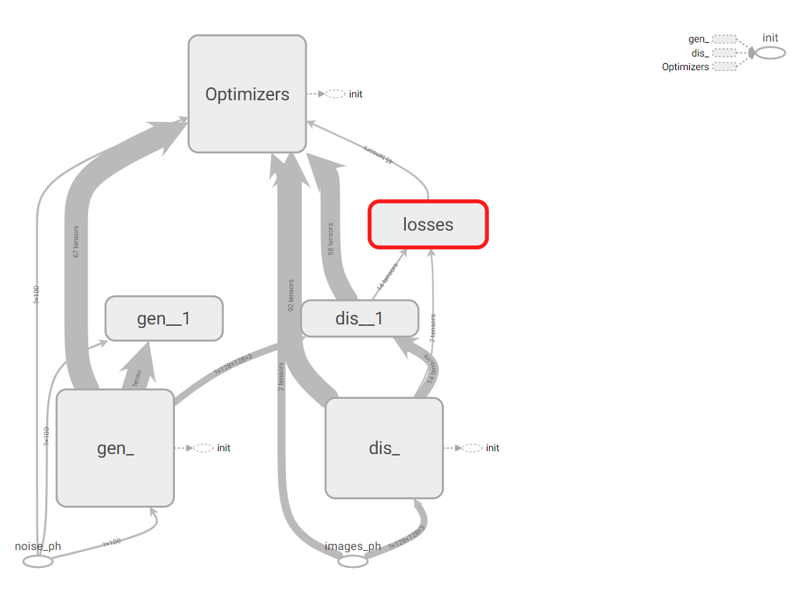
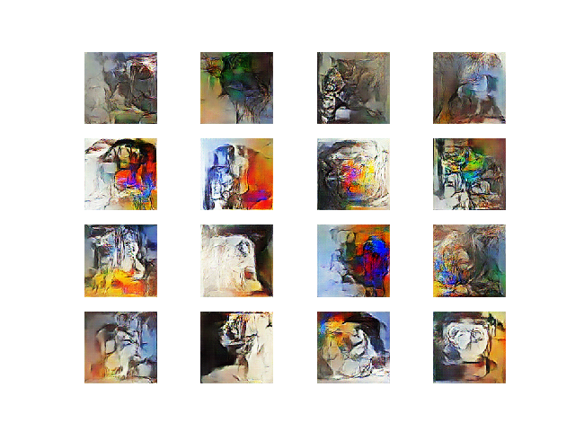
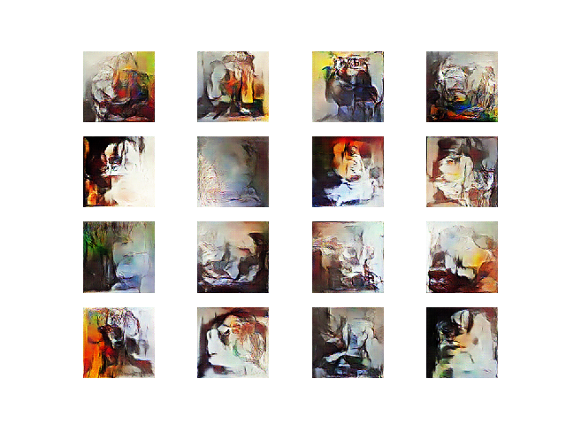

# PsychoGAN

PsychoGAN is GAN made Tensorflow that generates 128 x 128 pixels images, a project made for fun

# Model

# Generator

The generator recieves noise, apply a dense linear layer and reshape to a conv2d compatible input, with then passes through:

A Conv2d_transpose (fillters = 128, kernel = 5, strides = 2)
A Batch Norm
A Relu Activation

A Conv2d_transpose (fillters = 64, kernel = 5, strides = 2)
A Batch Norm
A Relu Activation

A Conv2d_transpose (fillters = 3 (img channels), kernel = 5, strides = 1)
A Tanh Activation

# Discriminator

The discriminator recieves images, classifying in real or fake. The model is as following:

A Conv2d (fillters = 64, kernel = 5, strides = 4)
A Batch Norm
A Leak Relu Activation (alpha = 0.2)

A Conv2d (fillters = 128, kernel = 5, strides = 2)
A Batch Norm
A Leak Relu Activation (alpha = 0.2)

A Flatten Layer
A Dense Layer (1 unit)
A Sigmoid Activation

# Data

The data used to train was composed of images from random cubism arts. This way, the similarities in the training set is only the paiting style.

# Training

In the discriminator, a learning rate of 0.0002 was used.
In the generator, a learning rate of 0.0001 was used.
In both, the optimizer used was Adam, with a beta1 of 0.5
Every step, the discriminator is updated one time and the generator was updated 2 times.

# Results

After 20000 training steps, which took 2 hours in a GTX 980, the generated images were:

As you can see, the generator learned how to use colors and created a unique style.

# Conclusion

This was a project made for fun, and possible no use, execpt share the code (explained) and show the results.

