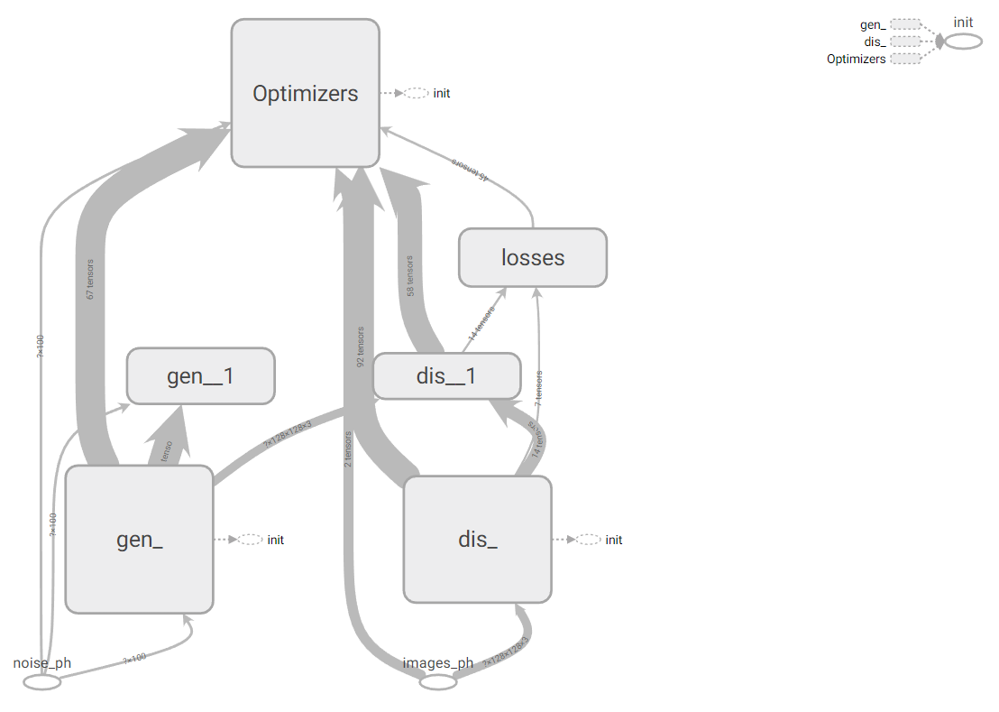
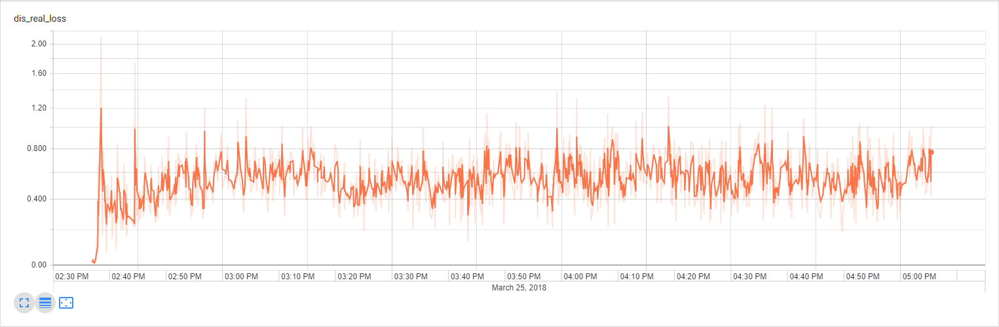
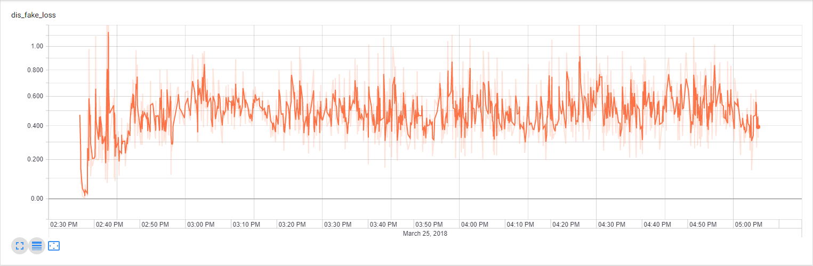
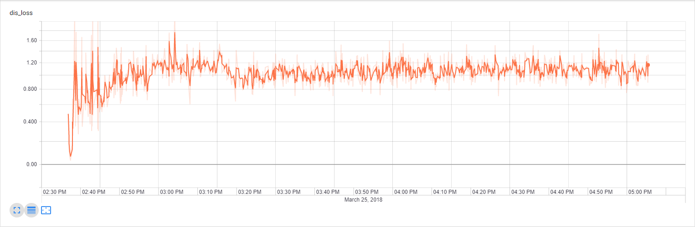
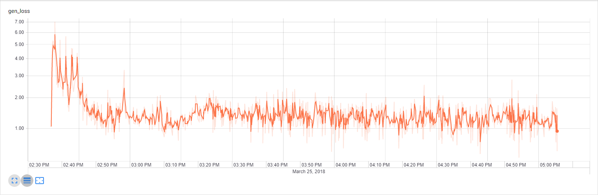

# PsychoGAN
 
PsychoGAN is GAN made Tensorflow that generates 128 x 128 pixels images, a project made for fun

# Model

# Generator
 
The generator recieves noise, apply a dense linear layer and reshape to a conv2d compatible input, with then passes through:
 
A Conv2d_transpose (fillters = 128, kernel = 5, strides = 2) 
A Batch Norm 
A Relu Activation 
 
A Conv2d_transpose (fillters = 64, kernel = 5, strides = 2) 
A Batch Norm 
A Relu Activation 
 
A Conv2d_transpose (fillters = 3 (img channels), kernel = 5, strides = 1) 
A Tanh Activation 

# Discriminator
 
The discriminator recieves images, classifying in real or fake. The model is as following:
 
A Conv2d (fillters = 64, kernel = 5, strides = 4) 
A Batch Norm 
A Leak Relu Activation (alpha = 0.2) 
 
A Conv2d (fillters = 128, kernel = 5, strides = 2) 
A Batch Norm 
A Leak Relu Activation (alpha = 0.2) 
 
A Flatten Layer 
A Dense Layer (1 unit) 
A Sigmoid Activation 

# Data
 
The data used to train was composed of images from random cubism arts. This way, the similarities in the training set is only the paiting style.

# Training
 
In the discriminator, a learning rate of 0.0002 was used. 
In the generator, a learning rate of 0.0001 was used. 
In both, the optimizer used was Adam, with a beta1 of 0.5 
Every step, the discriminator is updated one time and the generator was updated 2 times. 
 
Real Images Discriminator Loss: 

Fake Images Discriminator Loss: 

Combined Discriminator Loss: 

Generator Loss: 

# Results
 
After 20000 training steps, which took 2 hours in a GTX 980, the generated images were:
 

 
As you can see, the generator learned how to use colors and created a unique style.

# Conclusion
 
This was a project made for fun, and possible no use, execpt share the code (explained) and show the results.

